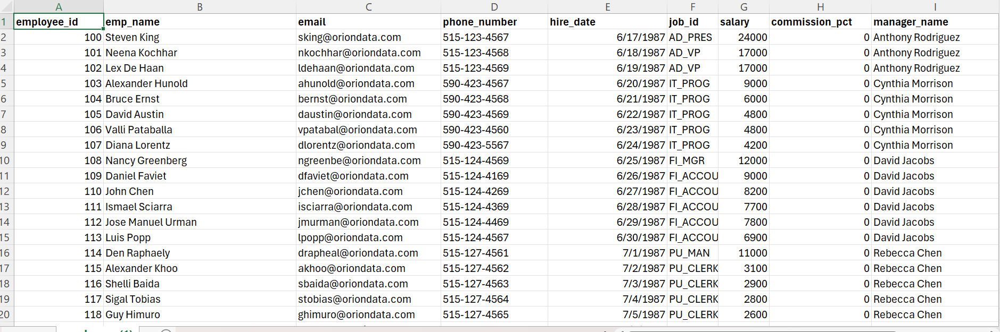
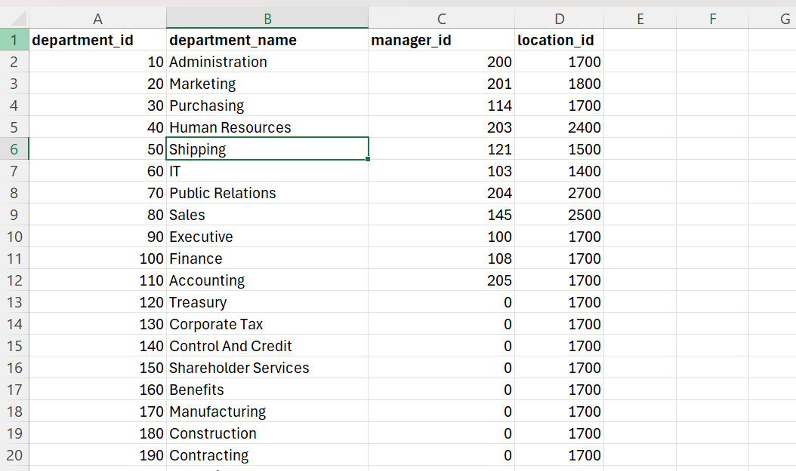
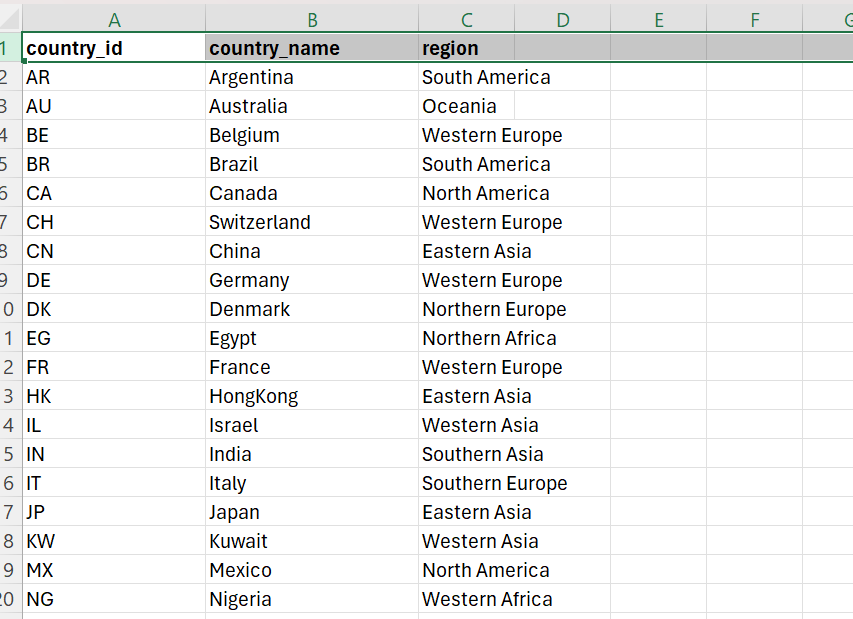
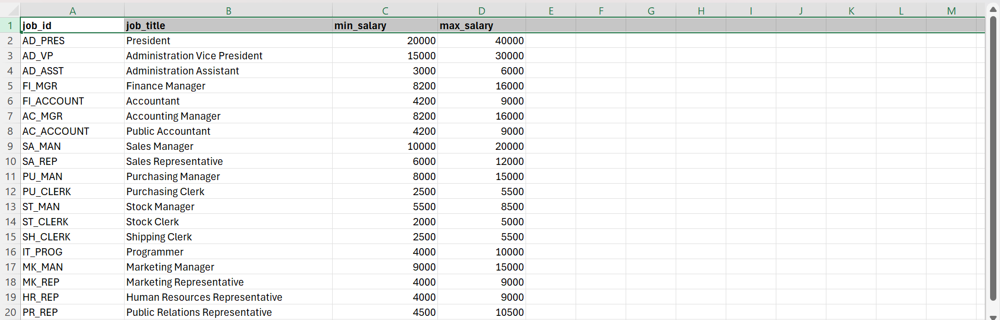
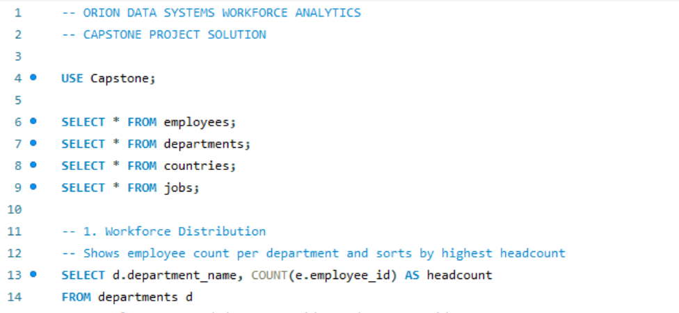
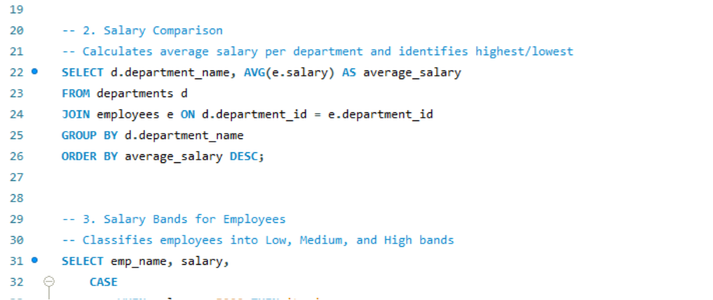

# Iron Data Systems Workforce Report 

## Executive Summary 
This project analyzed workforce data for Orion Data Systems using SQL. The objective was to answer key business questions related to employee distribution, salaries, departmental performance, country operations, and workforce planning. SQL concepts such as JOINs, GROUP BY, Aggregate Functions, CASE Statements, Subqueries, and CTEs were used to generate insights.

## Business Context
Orion Data Systems seeks to better understand its workforce structure, salary distribution, and departmental performance across multiple locations. This SQL analysis provides insights to support data-driven decisions in workforce management, compensation planning, and organizational growth.

## Objectives 
- Analyze employee distribution across departments.
- Compare average salaries by department.
- Categorize employees into salary bands.
- Examine departmental presence across countries.
- Identify high-earning employees.
- Evaluate salary trends by job role and country.
- Detect workforce gaps and unfilled job roles.

## Data Overview
The dataset consists of four interconnected tables: Employees, Departments, Jobs, and Countries. These tables contain information on employee details, salary records, department assignments, job roles, and company locations. The data was imported into a SQL database and linked using common keys to enable comprehensive workforce analysis. This structured dataset supports the evaluation of employee distribution, compensation trends, departmental performance, and country-level operations.

## Data Preview
### Employees Table

### Departments Table

### Countries Table

### Jobs Table

## Key Findings
- Employee distribution varies across departments, highlighting differences in workforce allocation.
- Average salaries differ significantly between departments, indicating varying compensation structures.
- Employees were successfully categorized into low, medium, and high salary bands, providing a clear view of salary distribution.
- Some countries host more departments than others, reflecting stronger organizational presence in those locations.
- Several employees earn above the company’s average salary, identifying top earners within the workforce.
- Certain job roles command higher average salaries, demonstrating the impact of specialization and responsibility on compensation.
- Total payroll expenditure varies by country, revealing differences in workforce costs across regions.
- Some job roles currently have no assigned employees, indicating potential staffing gaps or recruitment opportunities.

  ## Queries
  
  

  ## SQL Script
  

  ## SQL Techniques Applied
- SELECT Statements
- INNER JOIN
- GROUP BY
- ORDER BY
- COUNT()
- AVG()
- SUM()
- CASE Statements
- Subqueries
- Common Table Expressions (CTE)
- HAVING Clause
- NULL Filtering

  ## Recommendations
- Optimize workforce allocation across departments.
- Review salary structures to ensure competitive compensation.
- Address staffing gaps through targeted recruitment.
- Monitor payroll costs across countries for efficient budgeting.
- Use workforce insights to support strategic business decisions.

  ## Tools Used
- Microsoft Excel (Data Source)
- SQL
- MySQL Workbench

  ## Conclusion
  The SQL analysis provided valuable workforce insights across departments, job roles, salaries, and countries. Through the use of advanced SQL techniques, the project supported data-driven decision-making related to workforce planning, compensation analysis, and organizational resource allocation.
